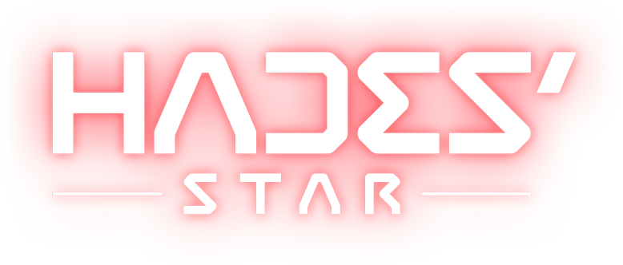

  

# Hades' Star Diary
Diary for [Hades' Star](https://store.steampowered.com/app/755800) :ringed_planet:  
[Discord for KR users](http://discord.gg/TR5CJ2p)

# Table of Contents
  

    
Day 457 - Gold_Crown

     청성 금왕관으로 업그레이드! :crown:   다음 시즌엔 꼭 청성 마스터... :sob:    
    <image src="./assets/20210928_Gold_Crown.png" align="center">
  

  

    
Day 454 - BS_League_Tip

     청색성단 리그 1일차에 청성 랭킹 6판 (all 1등 시 총 72점) 확보 방법    문제 상황 :   리그 시작 전에 청성을 안하고 쌓아두면 청성 보상이 2일치 쌓이듯 랭킹 6판 (하루에 랭킹 3판씩 생성) 이 쌓여있을거라고 생각하지만   실은 랭킹 3판 + 1판 = 4판 밖에 쌓이지 않는다   청성 랭커를 노린다면 몇점 차이로 승부가 갈리는 경우도 있으므로, 이는 매우 크리티컬한 문제다.    해결 방법 :   청성 리그는 한국 시간으로 대략 새벽 2시 20분에 시작하고 끝난다. 이 점을 이용하여 다음과 같은 플레이가 가능하다      1. 리그 종료 1d 5h 전 (한국 시간 9시) 에 청성 랭킹 3판을 완료한다   2. 리그 종료 0d 5h 에는 청성을 하지 않는다 (랭킹 3판 생성)   3. 리그 종료 후 새로운 리그에서 리그 종료 29d 23h 50m (한국 시간 새벽 2시 30분)에 청성을 한다    4. 이후 29d 5h 쯤 랭킹 3판이 다시 생기면 청성을 한다 (청성 1일차 랭킹 6판 완료)   5. 새로운 리그가 종료되기 전에 (30일 * 3판) + 3판 = 93판을 플레이      리그 기간 내내 all 1등 시 93판 * 12점 = 1,116점으로 이론 상 최대점수 획득이 가능하다.      참고로 역대 청성 1등은 940 ~ 1,000 점 수준에 형성되어 있으며 이는 1등/1등/2등 = 32점으로 하루 평균 4점 감점 당한 수준이다. 
  

  

    
Day 440 - Lv9_Teleport

     9텔의 위엄... 어마무시한 범위보소 :100:   근데 수소 소비량 800... :pensive:       
    <image src="./assets/20210911_Lv9_Teleport.png" align="center">
  

  

    
Day 438 - Lv8_Vengeance

     복수 8렙 달성 :star2:       
    <image src="./assets/20210909_Lv8_Vengeance.png" align="center">
  

  

    
Day 433 - Lv200

     200렙 달성! 플레이 433일만에 튜토리얼 끝낸 늅 :hatching_chick:    
    <image src="./assets/20210904_Lv200.png" align="center">
  

  

    
Day 430 - Lv4_Dart_Launcher

     다트 4렙 달성...!   이제 가디언 한방따리! 드루와 드루와 :boom:    
    <image src="./assets/20210901_Lv4_Dart_Launcher.png" align="center">
  

  

    
Day 429 - BS_Bonpulse

     청성 업계인의 새로운 무기 : 끈펄스 :star2:      [youtube video](https://youtu.be/lKttyMr1nCE)      
    <image src="./assets/20210831_BS_Bonpulse.png" align="center">
  

  

    
Day 426 - Lv3_Dart_Launcher

     다트 3렙 완료!   좀 더 강해진 기분이 든다 :muscle:      
    <image src="./assets/20210828_Lv3_Dart_Launcher.png" align="center">
  

  

    
Day 425 - RS_Dart_Player

     9적 다다대 조합으로 성공적 변경 :kissing_heart:    처음에는 적응안돼서 1행 실패 3~5회 연속으로하다가...   눈물을 흘리며 텔 모두 빼고 강화에 복수2개까지 껴서 1행 간신히 성공...    이 렙 먹고 뚜벅이라니!!! :sob:   하지만 좀 더 돌다보니 손(?)이 업그레이드 되어서 다시 강화랑 복수 하나 빼고 텔포 재설치 후 솔로 1행 성공!   뚜벅이 탈출 성공 :innocent:    현재 조합은    8대형/4오실/8텔/7복수/3재활/1안식   2다트/5블실/8텔/7장벽/3재활/1안식   2다트/1광실/8텔/7장벽/3재활/1안식    
    <image src="./assets/20210827_RS_Dart_Player.png" align="center">
  

  

    
Day 422 - Lv2_Dart_Launcher

     다트런쳐 2렙 :rocket:     인터셉터 한방 컷 나오는 5렙까지 쭉 달릴 예정 :wink:    
    <image src="./assets/20210824_Lv2_Dart_Launcher.png" align="center">
  

  

    
Day 412 - Lv9_Trade_Station

     교역정거장 9렙 완공!    
    <image src="./assets/20210814_Lv9_Trade_Station.png" align="center">
  

  

    
Day 399 - Hydro_Cap_30K

     수소캡 30만 달성!    
    <image src="./assets/20210801_Hydro_Cap_30K.png" align="center">
  

  

    
Day 393 - Warp_Lane_Hub_6M

     6M 워프레인허브 완공!   스페이스 나스카 문양을 완성해가고 있다... :star_struck:    
    <image src="./assets/20210726_Warp_Lane_Hub_6M.png" align="center">
  

  

    
Day 381 - First_Lv30_Planet_Opal

     첫 레벨 30 행성...!   우주엘레베이터가 인상적이다. 언제 설치됐지 :monocle_face:       
    <image src="./assets/20210714_First_Lv30_Planet_Opal.png" align="center">
  

  

    
Day 371 - Lv9_Laser

     9레 완성!   6레부터 한번에 쭉달려서 9레가 되니 정말 체감 파워 뿜뿜 :star_struck:    이제 청성에서도 백성에서도 맞대결이 두렵지 않다 :muscle:       
    <image src="./assets/20210704_Lv9_Laser.png" align="center">
  

  

    
Day 366 - 1_Year_at_Hades_Galaxy

     하데스 은하계 진입 1주년 :kissing_heart: 
  

  

    
Day 363 - Lv9_Shipment_Drone

     수송품드론 9레벨 달성!!! :moneybag:    수소소비량 7,500 -> 10,000 으로 증가       
    <image src="./assets/20210626_Lv9_Shipment_Drone.png" align="center">
  

  

    
Day 361 - Lose_The_Battle_Win_The_War

     백성 격언 중 "상대 콥에 12끈이 보이거든 1행이나 하라..." 는 말이 있다   질게 뻔한 한타 싸움... 하지만 백성에서는 기습적 동맥경화(?) 한 방이면 모든 게 끝!    방심한 상대는 우리 전함들을 한번 전멸시키고 유물을 163개나 10행에 넣어두고도 딱 2개...   그것도 인트러스트로 간신히 가져갈 수 있었다 ㅋㅋㅋ    최종 스코어는 자그마치 26 : 2 로 낙승!    [youtube video](https://youtu.be/qNXM8x_8c8g)     
    <image src="./assets/20210624_Lose_The_Battle_Win_The_War.png" align="center">
  

  

    
Day 360 - Fame_30K

     명성 30,000 달성!!    
    <image src="./assets/20210623_Fame_30K.png" align="center">
  

  

    
Day 359 - Credit_Rich

     나도 이제 크레딧 부- 자 :moneybag:    
    <image src="./assets/20210622_Credit_Rich.png" align="center">
  

  

    
Day 351 - Warp_Lane_Hub_5M

     5M 워프레인허브 완공 :star_struck:    
    <image src="./assets/20210614_Warp_Lane_Hub_5M.png" align="center">
  

  

    
Day 349 - Credit_Cap_5M

     5백만 클캡 달성!  드뎌 워프레인, 수송드론 5백만따리 업그레이드 하겠구먼!    
  

  

    
Day 349 - Relic_Drone_is_Stronger_than_Battleship

     긴장이 흐르는 국경지대...    초반 격전지 였던 10시 방향 10행에서 무력으로 밀린 후 :sob:   급하게 5시 방향 10행으로 변경.    근데 웃긴 건 압도적 점수 차이로 이길 예정 :roll_eyes:   고렙 유물드론이 이렇게 중요합니다...    
    <image src="./assets/20210612_Relic_Drone_is_Stronger_than_Battleship.png" align="center">
  

  

    
Day 349 - Space_Quadrilateral

     범- 우주적 도형 생성...      
    <image src="./assets/20210612_Space_Quadrilateral.png" align="center">
  

  

    
Day 345 - WS_Double_Vengeance

     더블 복수 예열 중...    
    <image src="./assets/20210608_WS_Double_Vengeance.png" align="center">
  

  

    
Day 339 - BS_Alpha_Drone

     청성 종이비행기 날리기의 핵심은 역시   종이비행기의 내구력!    1렙 : 400, 2렙 1,200, 3렙 2,500 인데   인셉 DPS가 90이니 3렙이면 인셉 3마리 협공도 약 9초 정도 버틸 수 있는 수준!    이정도면 인셉 날리기엔 이론상 충분하다   빨리 올려서 다음 시즌은 제발 성공적으로... :weary:    
    <image src="./assets/20210602_BS_Alpha_Drone.png" align="center">
  

  

    
Day 339 - BS_Powerful_Dart_Play

     다트 1렙 + 광실 1렙으로 전함 2대 순삭하기...   진짜 맞기만하면 엄청 쎄긴하다 다트 :star_struck:    [youtube video](https://youtu.be/yTFV_2I4Hbc) 
  

  

    
Day 338 - BS_Dart_Launcher_Review

     청성 다트 모듈로 도전 후기   1. 인셉은 최악의 적 :   딱 달라붙은 상태 아니면 같은 위치에서 인셉 하나한테 영거리 다트 쏴도 못 맞춘다 (오메가 실드 사용 시)    2. 다트의 긴 사정거리는 패널티 :   보통이면 안 닿고 스쳐지나갈 위치인데 어그로 끌려서 인셉들이 몰려듬 :weary:    3. 종잇장도 맞들면 망 :   다트와 본체가 인셉에게 동시에 맞으니 안 그래도 종잇장인 광역실드가 살살 녹아버림 :sob: (광역 실드 사용 시)    4. 너덜너덜 :   타임워프로 실드 2장 쓰는데도 켈베들 처리하고나면 너덜너덜...   광역 실드는 살살 녹아서, 오메가 실드는 딜 로스가 너무 많아서.. :vomiting_face:    결론    다트는 고급 사용자용 모듈 맞음 ㅇㅇ; 당할 땐 신박한데 쓰는 입장에선 좋지만은 않은 모듈     이번 시즌은 망... 알파드론 3렙으로 인셉들 싹 치우는 거 가능한지 시험해보고  안된다 싶으면 차라리 원래 하던대로 포격끼고 도는 게 나을 듯   랭크 매칭율로 보나 승률로 보나 이래저래... 
  

  

    
Day 337 - WS_Gate_Keeper

     다트 찍고 처음으로 해보는 백색성단 게이트키퍼    주요 임무는 펫 삼을 켈베 하나를 끈텔로 납치 후 다트로 피해 없는 교전상태를 유지,   외근 나간 다른 전함들이 도약으로 빠른 귀환 & 모듈 교환이 가능하도록 하는 것    이 직무는 간단해보이지만 사실 텔, 끈, 다트, 장벽 4개 모듈이 필요한 콤비네이션...!!    
    <image src="./assets/20210531_WS_Gate_Keeper.png" align="center">
  

  

    
Day 335 - BS_Dart_Launcher

     청색성단 다음 시즌 도전 준비 (거의) 완료...   끈 2렙이랑 알파드론 3렙으로만 올리면 되는데,   뭐 크리티컬한 셋팅인 다트 1렙과 복수 7렙은 준비가 완료되었으니 문제 없음!    
    <image src="./assets/20210529_BS_Dart_Launcher.png" align="center">
  

  

    
Day 334 - WS_Explosion

     하데스 스타 최고의 장관은 역시 백색성단 폭파씬 :bomb:    
    <image src="./assets/20210528_WS_Explosion.png" align="center">
  

  

    
Day 330 - Full_House

     마지막 섹터 스캔을 끝으로 마지막 행성이자 두번째 얼음행성 발견 완료! :ice_cube:   두개의 강한켈베기지를 적성3+청성1+백성1 = 전함 5대 총동원해서 밀어버리고   노랑성단 탐험가 + 식민지 개척자 업적도 완료하니,   이제 후반부 컨텐츠에 들어섰구나... 하는 느낌이 확~ 온다 :sweat_smile:    
    <image src="./assets/20210524_Full_House.png" align="center">
  

  

    
Day 328 - MVP_Flagship

     이번 백색성단의 MVP : 기함   유물 22개 + 수송 2대 + 채굴 1대 잡아먹는 기염을 토해 승리 굳히기를 해냄...!   상대는 10행 점거하고 우리는 5행 점거했는데 ㅋㅋㅋㅋㅋ   게이트키퍼가 얼마나 중요한 포지션인지 확인할 수 있었던 판이었음 :laughing:    
    <image src="./assets/20210522_MVP_Flagship.png" align="center">
  

  

    
Day 325 - Who_Let_the_Dog_Out

     1다트 2광실 12탐웦의 무시무시함을 목격...   기동력 실화냐...   이기긴 했는데 리얼 운빨 :fearful:    [youtube video](https://youtu.be/PIAtvsS8rHk)    
    <image src="./assets/20210519_Who_Let_the_Dog_Out.png" align="center">
  

  

    
Day 324 - First_WS_15_vs_15_Win

     백색 첫 15 vs 15 승리...!   9적 오고 3티어 승리를 하니 120만 클딧에 8만 수소...! :moneybag:   달달하다 :honey_pot:    
    <image src="./assets/20210518_First_WS_15_vs_15_Win.png" align="center">
  

  

    
Day 324 - Last_Sector_Scanning

     마지막 섹터까지 오픈 중...   결국 끝을 보게 만드는구나 더럽게 안나오는 얼행2... :sweat:      
    <image src="./assets/20210518_Last_Sector_Scanning.png" align="center">
  

  

    
Day 322 - BS_Nose_Dive

     "난 죽음을 택하겠다!"    [youtube video](https://youtu.be/GCREdQUiNvI) 
  

  

    
Day 322 - Immolation_1_tick

     기함 이몰레이션을 처음 직접 써봤다...   1틱 차이로는 피가 0이되어도 켈베 함선 이미지가 남아있다는 것을 확인 신기신기... :sweat_smile:    
    <image src="./assets/20210516_Immolation_1_tick.png" align="center">
  

  

    
Day 321 - BS_Warrior

     청색성단 워리어 업적 완료!    
    <image src="./assets/20210515_BS_Warrior.png" align="center">
  

  

    
Day 310 - BS_Interceptor_Collectors

     착한인셉 42친구 모으기 퀘스트...   게으름피우다 2시간 남짓 남았을 때 18친구밖에 못 모은 상태였는데   청성에서 수기+재활용+강화+안식끼고 인셉대환장파티를 열어 가볍게 해결!   참고로 돌다보니 안건데 내 전함 터진 이후에 인셉을 다른 전함이 잡더라도 카운트 올라감!    [youtube video](https://www.youtube.com/watch?v=jO-uUAJO9wc)    
    <image src="./assets/20210504_BS_Interceptor_Collectors.png" align="center">
  

  

    
Day 295 - Alone_in_the_Dark

     강력한 켈베기지와 켈베함선이 그득할게 뻔한 미확인섹터를 안전하게 건너가는 채굴이...    
    <image src="./assets/20210419_Alone_in_the_Dark.png" align="center">
  

  

    
Day 290 - Lv8_Trade_Station

     교역정거장 8렙 완공!   교역정거장 6렙의 약 2배 효율... 믓찌다...   수송품 당 1,000 클딧 넘었다고 좋아했었는데 이젠 2,000 클딧! :heart_eyes:    
    <image src="./assets/20210414_Lv8_Trade_Station.png" align="center">
  

  

    
Day 288 - Private_RS_Event_Season_10

     비공개 적색성단 이벤트 시즌 10 종료    혁명군 코퍼레이션 136위 / 342,029점   NOVA 코퍼레이션 181위 / 302,197점    NOVA 콥에선 기본급 100% 인상(?) 받고 용병으로 뛰었고 (8적 16개, 7적 142개, 6적 18개) * 2 매출을 내는데 성공 :laughing:   200위권 밖일때부터 달려서 결국 200위 순위권에 뙇 모습이 나올 때의 그 뿌듯함이란...     7적 비공으로 유물 2배로 받아가며 뛰니 수소가 흑자가 나는 것을 볼 수 있었다...! 넘나리 풍성한 이벤트!   I also credit joa :money_mouth_face:      
    <image src="./assets/20210412_Private_RS_Event_Season_10.png" align="center">
  

  

    
Day 287 - EMP_Party

     신나게 터지는 EMP에 맞춰 인셉 댄스...    [youtube video](https://youtu.be/SmfuUwMQXh0)  
    <image src="./assets/20210411_EMP_Party.png" align="center">
  

  

    
Day 278 - Lv7_Trade_Station

     교역정거장 7렙 완성!   시간 당 1,568 클딧 :kissing_closed_eyes:    
    <image src="./assets/20210402_Lv7_Trade_Station.png" align="center">
  

  

    
Day 276 - Last_Fame_Quest

     마지막 명성퀘 완료...!   27,000 명성에 750,000 크레딧 112,500 수소 획득 :laughing:    
    <image src="./assets/20210331_Last_Fame_Quest.png" align="center">
  

  

    
Day 270 - Hydro_Farm

     부계 첫 포도밭 완성!   섹터 당 보유 수소량 : 21,000 = 1,500 * 14    제네시스 1렙으로 시작해서 정말 오래걸렸다 :sob:    
    <image src="./assets/20210325_Hydro_Farm.png" align="center">
  

  

    
Day 270 - TS_30_Ton_Cargo

     수송선 30톤 달성...!!!   이제 7적 3개씩, 9적 2개씩! :blush:    
    <image src="./assets/20210325_TS_30_Ton_Cargo.png" align="center">
  

  

    
Day 261 - Discover_Planet_Exile

     첫번째 얼음행성 발견...!!! :ice_cube:    
    <image src="./assets/20210316_Discover_Planet_Exile.png" align="center">
  

  

    
Day 260 - Seven_Planets_Aligned

     부계 행성이 드디어 7개 1열로 완성되었다...   하데스 스타에서 행성을 1열로 늘어놓을수 있는 최대치 :zany_face:   이제 우주가 멸망할 일만 남은 건가    
    <image src="./assets/20210315_Seven_Planets_Aligned.png" align="center">
  

  

    
Day 255 - Area_Shield

     9적에서 광역실드 도입...   처음엔 오메가실드 2대 빼고 광실 2대 넣었는데   너무 종잇장이라... 선봉함은 오실로 교체했더니 편- 안.    화력 딸려서 3포격 했더니   피닉스 터지고 나오는 힐링포션(?) 인 센티넬들이   독약으로 바뀌어서 엄청 따가웠는데 :skull_and_crossbones:    이제 블실함 터질 걱정 안해도 되서 기쁘다 :laughing:    
    <image src="./assets/20210310_Area_Shield.png" align="center">
  

  

    
Day 254 - RS9_Croid_Mining

     오늘도 평화로운 9적 꿀광...   이웃 섹터 폭격기 & 스톰이 격한 환영 중이다    [youtube video](https://www.youtube.com/watch?v=-eu2N5eVj0s) 
    <image src="./assets/20210309_RS9_Croid_Mining.png" align="center">
  

  

    
Day 253 - First_RS9

     첫 9적 진입...   9적 행성이 불 행성인 이유를 알았다   불 맛이기 때문이다 :fire:     EMP 쓰고 1스톰, 2피닉, 1봄버 섹터를 밀어보려했으나 전멸 :sob:   화력 창렬... :vomiting_face:   8포격이 시급하다...       ==========================  대형화포 빼고 EMP + 3포격 셋팅으로 화력 보강하여 1행 성공...!   8적 처음갔을때 재활용 빼고 4렙 전함으로 몸비틀어 깨던만큼은 아니지만 역시 편안한 클리어는 아님 :weary:   그나저나 9적 15톤이라 유물 1개씩 들고오니 수송선 6대 가야 행성 1개 간신히 다 털어오네... :sob:   10화물실확장 모듈 1순위로 변경!!!   도면 2,333장 더 모아야한다...    
    <image src="./assets/20210308_First_RS9_01.png" align="center">  <image src="./assets/20210308_First_RS9_02.png" align="center">
  

  

    
Day 253 - Sub_Lv100

     부계 100렙 달성...!    
    <image src="./assets/20210308_Sub_Lv100.png" align="center">
  

  

    
Day 252 - Credit_Cap_4M

     400만 클캡...! :money_mouth_face:   9적 가즈아!!!    
    <image src="./assets/20210307_Credit_Cap_4M.jpg" align="center">
  

  

    
Day 249 - Daily_Revenue

     크레딧 1일 수입 내역    총합 : 1,245,685     청성 : 169,650   꿀광 (적성 8렙) : 300,000 = 150,000 * 2 (2배 이벤트)   유물 연구 (적성 8렙 테트) : 49,600 = 6,200 * 8회   유물 재활용 (적성 7렙) : 192,000 = 2,400 * 20개 * 4회   수송 (수송품드론 8렙, 교역정거장 6렙 3개, 행성 14개) : 534,435 = 1,245,685 - 169,650 - 300,000 - 49,600 - 192,000    
    <image src="./assets/20210304_Daily_Revenue.PNG" align="center">
  

  

    
Day 247 - Croid_Event

     적성 꿀광 2배 이벤트라니...   이럴줄 알았으면 교역정거장 업글할게 아니라 빨리 9적부터 갔을텐데 ㅠㅠ    크리스탈 박아볼까... 잠시 생각했으나 9적 기준 2배 45만 클딧이라 8적 기준 30만 클딧이랑 차이가 15만 클딧...   7일 차이라고 생각하면 105만 클딧...   일일 클딧 수입이 100만이니 그냥 하루 놀았다 생각하고 패스하는 걸로... :sob:      
    <image src="./assets/20210302_Croid_Event.PNG" align="center">
  

  

    
Day 238 - Mega_Corp

     Mega Corp. 개념 및 소개    Hades' Star 의 적색성단(이하 적성으로 축약표기) 매칭은 크게 2가지다     1. 전세계 유저 임의 매칭 (= 공개적성, 공적)     2. 코퍼레이션 내 매칭 (= 비공개적성, 비공)    이때 1번의 문제는 수질(?) 이 너무 안좋다는 것이다   매칭돼고 유물이 있는 행성을 클리어하기보단 크레딧을 주는 Croid 만 캐고있거나   아예 전함은 워프를 시키지도 않는 날먹러가 있거나...   심한 경우 인터셉터 및 디스트로이어를 이용한 트롤링까지 다양하다    그래서 2번을 택하자니...    내가 속해있는 코퍼레이션에 내가 도는 적성 레벨에 맞는 유저가 대기중인 경우가 적다는 단점이 있다   이에 양쪽의 단점을 메꾸기 위해 생겨난 것이 콥들의 연합체인 "메가 코퍼레이션" (이하 메가콥으로 축약표기)이다    메가콥을 만들기 위한 준비물은 다음과 같다     1. 디스코드 서버     2. 유저 매칭큐를 위한 봇 개발     3. 매칭된 유저들이 모여서 비공을 돌릴 코퍼레이션들 (자리가 부족할 경우를 대비해 여러개의 콥이 필요하다)    현재 활발하게 돌고있는 메가콥으로는...    [Black Star Order](https://discord.gg/YrCvGAYCbm)   [United Industries of Hades](https://discord.gg/GNyBZyw97W) 등이 있다    BSO 는 적성을 돌기위한 최소모듈렙 기준이 있으며 수소채굴 및 행성공략순서 등 룰이 타이트하다     한편 UIH 의 경우 해당 최소조건이 없으며 전반적으로 자유로운 편이다    플레이 자유도 : BSO < UIH < 공적    필자는 UIH를 주로 돌기에 해당 메가콥 이용법에 대한 간단한 소개를 첨부한다    1. 가입: 위 첨부한 discord url 을 통해 가입 후 #lobby 에서 관리자에게 게임 내 소속 콥 및 이름을 말하고 ally 권한을 받는다 (guest -> ally)      2. self 권한주기 (적성 ping 요청): #self-assignable-roles 에서 ping (알림) 을 받길 원하는 적성 레벨 이모지를 클릭한다      3. 자신의 전함 상태에 따른 정보 표시: #lobby 에서 !rsmod 라고 타이핑하면 DM(개인메세지) 으로 자신의 전함 상태를 표시할 수 있는 메뉴가 전달된다      4. 적성 큐에 참여: #uih-rs 에서 참여하길 원하는 적성 레벨 이모지를 클릭한다      5. 적절한 콥에 모여 비공 참여: 구성 자회사(?) 콥 명단은 #welcome 에 나와있으니 참고 
    <image src="./assets/20210221_Mega_Corp_01.png" align="center">  <image src="./assets/20210221_Mega_Corp_02.png" align="center">  <image src="./assets/20210221_Mega_Corp_03.png" align="center">  <image src="./assets/20210221_Mega_Corp_04.png" align="center">  <image src="./assets/20210221_Mega_Corp_05.png" align="center">
  

  

    
Day 224 - Lv6_Trade_Station

     교역정거장 6레벨 달성...!   드디어 1,000 클딧 넘는 수송품들이 보이기 시작했다 :laughing:    
    <image src="./assets/20210207_Lv6_Trade_Station.png" align="center">
  

  

    
Day 223 - Lv8_Teleport

     Lv8 텔레포트 장착!   황색성단에서조차 엄청 넓다...!   다 좋은데 이용료가 500 수소로 증가... ㄷㄷ      
    <image src="./assets/20210206_Lv8_Teleport.jpg" align="center">
  

  

    
Day 219 - Lv8_Shipment_Drone

     수송품드론 8렙!   수소 소비량이 5,000 -> 7,500 으로 증가...   그리고 드디어 기다리고 기다리던 텔레포트 8렙 클릭!     
    <image src="./assets/20210202_Lv8_Shipment_Drone.jpg" align="center">
  

  

    
Day 217 - The_Revenant

     혁명군 콥 비공개 적성에서 있었던 사건   제목은 "레버넌트: 죽음에서 돌아온 자" 정도로 하면 될듯...?   채굴이 장벽과 수송선 발송과 텔 기타 등등으로 간신히 사상자 발생은 막음 ㅋㅋㅋ    [youtube video](https://www.youtube.com/watch?v=TYgv0dWEKZE)    
    <image src="./assets/20210131_The_Revenant.png" align="center">
  

  

    
Day 214 - Lv7_Shipment_Drone

     수송품드론 7렙!   수소 소비량이 4,000 -> 5,000 으로 증가...   연이어 수송품드론 8렙 클릭!    
    <image src="./assets/20210128_Lv7_Shipment_Drone.jpg" align="center">
  

  

    
Day 211 - Sudden_Attack

     채굴을 마치자 채구리 편대가 펼쳐지면서 센티넬의 기습을 받았다...   ... 내가 이래서 채굴함은 모조리 안식처를 달지 -_-;    다시 돌려보니 육안으로는 펼쳐진거 같지도 않은게 함정    [youtube video](https://www.youtube.com/watch?v=Th024yHSZQU) 
  

  

    
Day 210 - BS_Bond_with_Teleport

     청성 끈텔 첫 성공...!   끈이 1렙이라 시간 엄청 짧은데다가   텔은 주로 인셉날리기만해서 =_=a (로우큐에선 나름 위협적...)   끈텔 콤보는 이제서야 처음 써먹어봄...!    [youtube video](https://www.youtube.com/watch?v=DthLX9jCKmE) 
  

  

    
Day 210 - Sub_First_RS6

     부계 첫 6적 진입...   현재 클캡이 25만이고... 7적이 100만이니까...     실화냐 =_=a    
    <image src="./assets/20210124_Sub_First_RS6.png" align="center">
  

  

    
Day 206 - Warp_Lane_Hub_3M

     3백만 워프레인허브 완공...!    
    <image src="./assets/20210120_Warp_Lane_Hub_3M.png" align="center">
  

  

    
Day 205 - Module_Open_Complete

     달콤한 11적 테트 오픈...   원격 폭탄 모듈을 끝으로 해제된 모듈 59/59 완성! 
  

  

    
Day 204 - BS_Mini_Event

     아몰라님이 주최하신 청성미니게임 공동2등...!    ===    참가자격   본계정으로 누구나 참여가능    진행일정 14일 00:00 ~ 21일 23:59    참가보상 1등 11적 사면체 40개   2등 11적 사면체 20개   3등 11적 사면체 10개   (수송함 용량 20톤미만인 분은 적재가능한 최고레벨 사면체로 지급)    ===    Kayden         12점 12점 12점 - 36점   Curycu         12점 08점 12점 - 32점   Voyager        12점 08점 12점 - 32점   MONSONG        12점 12점 05점 - 29점   기원설화       12점 05점 12점 - 29점   Grandverg      08점 03점 12점 - 23점   jin6939        08점 00점 12점 - 20점 
  

  

    
Day 199 - TS_24_Ton_Cargo

     드디어 수송선 24톤 달성!   8적 2개씩, 6적 3개씩 콜~!   수소 절약의 시작...!!!    
    <image src="./assets/20210113_TS_24_Ton_Cargo.png" align="center">
  

  

    
Day 197 - Salvage_Bug

     황색성단에서 힐섹터를 만들었는데...   왜 옆 섹터에서 터져도 피가 차는걸까 =_=?    [youtube video](https://www.youtube.com/watch?v=pqmCUCXy79s)    
    <image src="./assets/20210111_Salvage_Bug.png" align="center">
  

  

    
Day 197 - Thin_Blast_Shield

     꿀광 캐는 김에 1행도 밀고 유물 캐오자... 로 시작된 비극...   옆집 디스트로이어가 놀러왔고 3렙 블실은 수송선 5대에 전함 3대까지 감싸기엔 너무 얇았고...   결국 수송선 5대가 터지는 비극으로 마무리...   발송 모듈까지 달아 총 손해는 약 112,500 * 5대 = 562,500 클딧   대략 0.7일의 수입을 손해보았다 ㅠ.ㅠ...    [youtube video](https://www.youtube.com/watch?v=KfxtjN9HZPc)    
    <image src="./assets/20210111_Thin_Blast_Shield.png" align="center">
  

  

    
Day 194 - Emp_at_Last_Second

     디스트로이어 행성파괴 1초 남겨두고 잡는 기분...!!   하데스스타 게임 플레이가 전반적으로 느- 린 편이긴한데   7렙 이상 적색성단들에서는 제법 긴박하다...    [youtube video](https://www.youtube.com/watch?v=Is1tyYsdiUA)    
    <image src="./assets/20210108_Emp_at_Last_Second.png" align="center">
  

  

    
Day 193 - Discover_Planet_Opal

     새로운 행성의 발견과 동시에 집 정리...   홈 경기에서는 전함 수 제한이 없어 아주 가뿐하다~    "... 포격 맛 좀 볼래?"    [youtube video](https://www.youtube.com/watch?v=hoBCpJ7jJRs)    
    <image src="./assets/20210107_Discover_Planet_Opal.png" align="center">
  

  

    
Day 192 - Dispatch_TS

     모든 수송선에 발송 설치 후 실전 투입...!   발송 1렙이 예열시간은 좀 걸리지만 (유물 6개면 24초*6개 = 144초 = 2분 24초)   수소 소비량이 1,000으로 가장 착해서 유지할 예정!   발송으로 가고 텔로 돌아오는 아주 바람직한 그림...    그러니 제발 터지지만 말아줘 :sob:   복구비는 1대 당 112,500 클딧 (...)    
    <image src="./assets/20210106_Dispatch_TS.jpg" align="center">
  

  

    
Day 190 - Credit_Cap_3M

     300만 클캡 :kissing_heart: 
  

  

    
Day 189 - Lv25_Glitter_Ring

     레벨 25가 되자 링에 반짝이가 뿌려짐 :ringed_planet: :sparkles:    
    <image src="./assets/20210103_Lv25_Glitter_Ring.png" align="center">
  

  

    
Day 188 - Destiny_vs_Vengeance

     운명 함선에 복수 쓰려는 분이 계셔서 교훈을 드렸음 :kissing_heart:    [youtube video](https://www.youtube.com/watch?v=VhcXbJYl2E4) 
    <image src="./assets/20210102_Destiny_vs_Vengeance.jpg" align="center">
  

  

    
Day 184 - BS_Dogfight

     오랜만에 매우 빡센 청성...    첫 번째 판은 끈으로 emp 사거리 밖에서 잡아 끄는데 성공했는데 1초 차이로 체력사하고 ㅠ...    두 번째 판은 시작부터 옆자리 파이터에게 시달리다가 간신히 도망갔더니   운명쓰고 우연히 다시 옆자리로 돌아와서 이엠피로 자기장사 시키려고하고 ㅠ...   살려고 운명 사거리도 안닿는데 긴급탈출버튼 누르듯 써서 ㅌㅌ 성공    다행히 완전 dogfight 상황이라 살아나오니 다 이긴 판이 되어있었다 =_=;    [youtube video](https://youtu.be/cs4y964ui7I) 
    <image src="./assets/20201229_BS_Dogfight.jpg" align="center">
  

  

    
Day 184 - United_Ships

     부계로 5적 공적 뛰다가 목격한 명장면...   뭉쳐야 산다...!    
    <image src="./assets/20201229_United_Ships_01.jpg" align="center">  <image src="./assets/20201229_United_Ships_02.jpg" align="center">
  

  

    
Day 182 - Logistics_Strategy

     # 수송품 드론 + 릴레이 수송 요약    1. 수송품 목적지는 각 행성 & 위성 & 교역정거장 1/N 확률인듯 (체감)     - 그렇다면 15렙 사막행성 (위성 2개) > 15렙 불행성 (위성 1개) = 15렙 바다행성 (위성 1개) > 나머지 행성 순으로 수송품 목적지가 많다    2. 수송품 드론 보너스 %를 늘리려면 같은 목적지 수송품을 한 곳에 모아두는 것이 좋다     - 50렙 행성들은 저장용량이 큰 편이라 수송품을 모아두는 역할에 딱이다     - 50렙 행성들에 워프레인허브 연결된 목적지들을 분배한다     - 참고로 행성의 수송품 최대 저장량은 수송품이 생산되는 최대량의 2배다 (50렙 가스행성은 40개 생산되므로 80개 저장가능)    3. 워프레인허브 연결된 섹터가 아닌 곳으로 가는 수송품들은 몰아놓고 릴레이행    4. 교역정거장들은 행성에 최대한 가까이 붙여 수소를 절약할 것...!     - 안타깝게도 행성 있는 섹터 안쪽에는 들어갈 수 없어 섹터 끝에 최대한 붙여놓는 게 한계다    5. 주황색 : 목적지 ID, 노란색 : 모아놓는 장소, 하늘색 : 모아놓고 릴레이    
    <image src="./assets/20201227_Logistics_Strategy.png" align="center">
  

  

    
Day 178 - TS_20_Ton_Cargo

     수송선 20톤 달성...!   드디어 7적 2개씩 들수 있게 됌 ㅠ.ㅠ...   이제 꿀광 빼곤 8적 바이바이 
  

  

    
Day 177 - Fame_20K

     명성 20,000 달성!!    
    <image src="./assets/20201222_Fame_20K.png" align="center">
  

  

    
Day 176 - Six_Planets_Aligned

     부계의 행성 6개가 1열로 늘어섬...   별들이 제자리를 찾았으니 이제 위대한 옛 존재들이 깨어난다...    
    <image src="./assets/20201221_Six_Planets_Aligned.png" align="center">
  

  

    
Day 172 - Lv5_Barrier

     장벽 5렙 업그레이드!   이제 나도 넓다!    
    <image src="./assets/20201217_Lv5_Barrier.png" align="center">
  

  

    
Day 172 - No_Santuary_TS_in_RS8_Battlefield

     콜로와 봄버의 맹공 사이에서 노안식 수송선으로 유물을 빼먹는 이 스릴...   가히 불닭볶음면 같은 중독성이 있다...    [youtube video](https://youtu.be/KW7218PDH0E)  
    <image src="./assets/20201217_No_Santuary_TS_in_RS8_Battlefield.png" align="center">
  

  

    
Day 169 - RS_Solo_Event

     아몰라님이 주최하신 솔로적성게임 8적부문 1등...!   ... 사실 참가자가 1명 :sob:    ===    최고레벨단계 적성을 1인 비공개로 한판 진행하여 가장 높은 포인트를 기록한 사람이 승리    참가자격   적성스캐너 최고레벨이 7-9인 본계정   7적 부문, 8적 부문, 9적 부문 3가지 중에서 최고레벨 부문으로만 참가가능    진행일정   지금~적성이벤트끝나는 순간 (2020.12.14 ~ 2020.12.16)    참가보상   9적부문1등 - 11적 보라 파랑 노랑 중 종류 선택하여 16개   8적부문 1등 - 11적 노랑 10적 보라 파랑 중 종류 선택하여 16개   7적부문 1등 - 10적 파랑 노랑 9적 보라 중 종류 선택하여 16개    ===    9적(3명참가) - jin6939(5278점)   8적(1명참가) - curycu(1716점)   7적 - 참가자없음 
  

  

    
Day 161 - No_Warp_Lane_Cross_Section_Shipment_Drone

    <image src="./assets/20201206_No_Warp_Lane_Cross_Section_Shipment_Drone.png" align="center">
  

  

    
Day 160 - BS_Low_Queue_Matching

     청성에서 적색스캐너레벨 평가 빠진 이후 5렙 전함인데도 3~4렙 전함 상대 로우큐만 잡히는 중   벌써 10판 가까이...    구성원 모듈렙이 다들 낮은 관계로 외톨이도 저렙, 중앙셀 켈베도 저렙.   청성 난이도 너무 높다면 일부러 저렙 모듈 껴놔서 난이도 다운하는 것도 좋은 방법일 것 같음    레이저 9렙 오메가실드 8렙 쓰고 5~6렙 전함에 중앙셀 스톰 만나는 것보단   그냥 썩혀둔 화포 6렙 패시브실드 5렙 쓰고 로우큐 매칭하는게 정신건강에 더 나을 수도...    
    <image src="./assets/20201205_BS_Low_Queue_Matching.png" align="center">
  

  

    
Day 158 - Lv5_Battleship_Chickenship

     치킨함 완성! :laughing:   드디어 다시 재활용 모듈을 설치!!    
    <image src="./assets/20201203_Lv5_Battleship_Chickenship.jpg" align="center">
  

  

    
Day 157 - Planet_Poison_with_2020_03_Update

     2020.03 update 되면서 행성 모습들이 변경...   특히 바다행성들은 묻지도 따지지도 않고 무조건 초록색 불빛이 나도록 변경되었다...    덕분에 나의 Rose 행성은 Poison 행성으로 개명 =_=   망...    
    <image src="./assets/20201202_Planet_Poison_with_2020_03_Update.png" align="center">
  

  

    
Day 155 - Five_Planets_Aligned

     부캐 키워보니 왜 행성뽑기운빨겜이란 말이 나왔는지 깨달음   행성 5개 직선배치 실화냐...   수송효율 똥망 :poop:    
    <image src="./assets/20201130_Five_Planets_Aligned.png" align="center">
  

  

    
Day 152 - Kill_The_Pheonix

     emp + teleport 선타 먹인 445 포포대 조합으로 8광 섹터 밀기 성공!   문제는 4렙 전함 텔 자리 없어 재활용 뺌 =_=   재활용 없이는 1섹터가 한계...    5렙 전함 업글 눌러놨으니   1주일 후엔 다시 재활용 끼는 걸로 ㅠㅠㅠ    
    <image src="./assets/20201127_Kill_The_Pheonix.png" align="center">
  

  

    
Day 151 - First_RS8

     8적 첫 진입   445 포포대 조합으로 피닉스 잡기 실패 ㅠ...    
    <image src="./assets/20201126_First_RS8.jpg" align="center">
  

  

    
Day 149 - Change_Weapons

     665 레듀대 조합에서 445 포포대로 전환...   아직 포격 뎀이 너무 낮아 장벽 체감시간이 너무 짧다 :tired_face: 
  

  

    
Day 146 - Out_of_Fuel_in_BS

     청색성단 끈으로 마무리 지으려고하는데...   상점으로 이동하라곸ㅋㅋㅋ?   수소 부족 청성으로 메꿀 땐 주의 :tired_face:    
    <image src="./assets/20201121_Out_of_Fuel_in_BS.png" align="center">
  

  

    
Day 146 - Zero_Fuel_Return_Success

     수소 0 상태로 적색성단 점프게이트 귀환   소문으로만 괜찮다고 듣고 해보긴 처음이라 두근두근...    
    <image src="./assets/20201121_Zero_Fuel_Return_Success.jpg" align="center">
  

  

    
Day 145 - Rush_to_Planet_Terra

    <image src="./assets/20201120_Rush_to_Planet_Terra.png" align="center">
  

  

    
Day 142 - Credit_Cap_2M

     200만 클캡 :laughing: 
  

  

    
Day 141 - Lv150

     150렙 달성 
  

  

    
Day 131 - Warp_Lane_Triangle

     150만 워프레인을 끝으로 항성외곽순환로 완공   1일 이용료 6660 수소    
    <image src="./assets/20201106_Warp_Lane_Triangle.png" align="center">
  

  

    
Day 121 - BS_Bond_Counter

     청색성단 6전함, 5전함, 외톨이 2대 매칭...   마지막 상대 5끈이라 반쯤 포기하고 있었는데 맞끈 카운터로 어찌어찌 기적적 승리...    [youtube video](https://youtu.be/TJeWz9vuZx8)  
    <image src="./assets/20201027_BS_Bond_Counter.png" align="center">
  

  

    
Day 117 - Discover_Planet_Orange

    <image src="./assets/20201023_Discover_Planet_Orange.png" align="center">
  

  

    
Day 109 - Discover_Planet_Ocean

    <image src="./assets/20201015_Discover_Planet_Ocean.png" align="center">
  

  

    
Day 106 - First_RS7

     7적 첫 진입   첫 진입 기념인지... 내 섹터 근처엔 오징어가 하나도 없었음   플레이해보니 무기를 더 올리거나 실드를 더 올리거나 해야할 듯... 
  

  

    
Day 99 - BS_200_Wins

     청색성단 200회 승리 
  

  

    
Day 95 - Silver_Crown

     청색성단 베테랑 칭호   은왕관 겟 :crown: 
  

  

    
Day 95 - Warp_Lane_Rules

     워프레인허브 본격 증설 시작...    
    <image src="./assets/20201001_Warp_Lane_Rules.jpg" align="center">
  

  

    
Day 87 - Lv100

     레벨 100 달성!  
    <image src="./assets/20200923_Lv100.jpg" align="center">
  

  

    
Day 78 - Favorite_Planet_Rose

     내가 제일 좋아하는 행성... 색이 아주 마음에 든다    
    <image src="./assets/20200914_Favorite_Planet_Rose.png" align="center">
  

  

    
Day 57 - WS_Battle

     처음 들어간 코퍼레이션인 토끼풀에서 백색성단 뛸 당시...    
    <image src="./assets/20200824_WS_Battle.jpg" align="center">
  

  

    
Day 54 - kst2410_Joined

     친구를 꼬셔서 게임 시작... 수소 약탈을 자주하러 감 =_=ㅋ    
    <image src="./assets/20200821_kst2410_Joined.jpg" align="center">
  

  

    
Day 41 - First_Warp_Lane_Hub

    <image src="./assets/20200808_First_Warp_Lane_Hub.png" align="center">
  

  

    
Day 30 - Discover_Planet_Alien

    <image src="./assets/20200728_Discover_Planet_Alien.png" align="center">
  

  

    
Day 2 - Lv1_Battleship_vs_Weak_Cerberus_Base

     꼬물이 1렙 전함으로 잘도 터트렸네... 실드도 알파실드 1렙이었는데 =_=a    
    <image src="./assets/20200630_Lv1_Battleship_vs_Weak_Cerberus_Base.jpg" align="center">
  

  

    
Day 1 - First_Day_at_Hades_Galaxy

     하데스 은하계 진입 1일차 :ringed_planet: 
  

