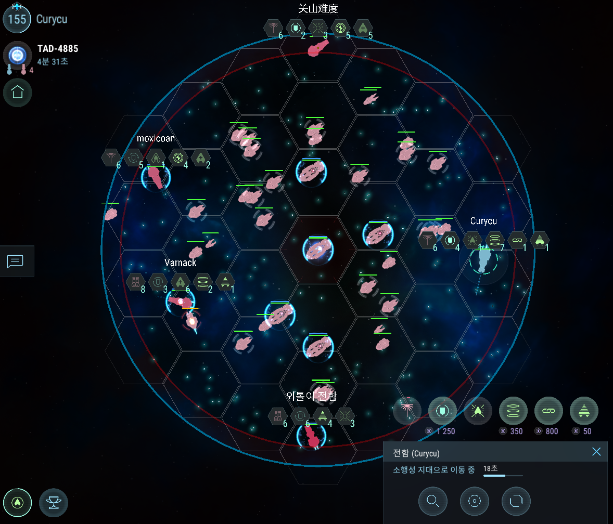

청성에서 적색스캐너레벨 평가 빠진 이후 5렙 전함인데도 3~4렙 전함 상대 로우큐만 잡히는 중 (벌써 10판 가까이...)  
구성원 모듈렙이 다들 낮은 관계로 외톨이도 저렙, 중앙셀 켈베도 저렙.  
청성 난이도 너무 높다면 일부러 저렙 모듈 껴놔서 난이도 다운하는 것도 좋은 방법일 것 같음  

레이저 9렙 오메가실드 8렙 쓰고 5~6렙 전함에 중앙셀 스톰 만나는 것보단 
그냥 썩혀둔 화포 6렙 패시브실드 5렙 쓰고 로우큐 매칭하는게 정신건강에 더 나을 수도...  

