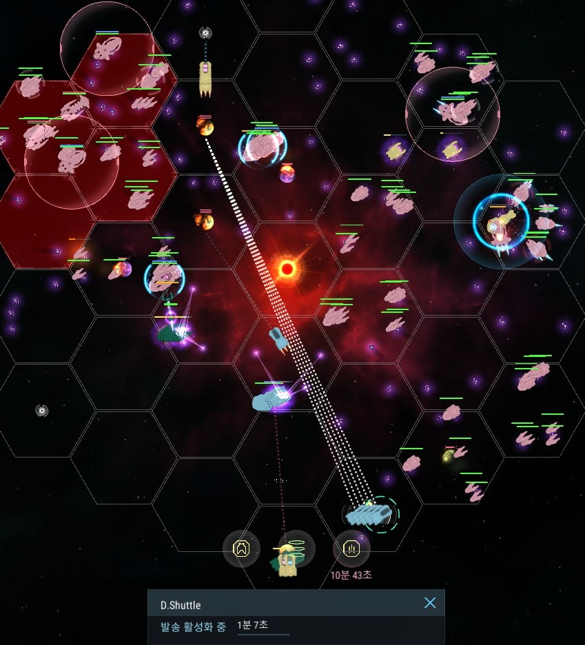

모든 수송선에 발송 설치완료 후 실전 투입...!  
발송 1렙이 예열시간은 좀 걸리지만 (유물 6개면 24초*6 = 144초 = 2분 24초)  
수소 소비량이 1,000으로 가장 착해서 유지할 예정!  
발송으로 가고 텔로 오는 아주 바람직한 그림...  

그러니 제발 터지지만 말아줘 :sob:  
복구비는 1대 당 112,500 클딧 (...)  

  
