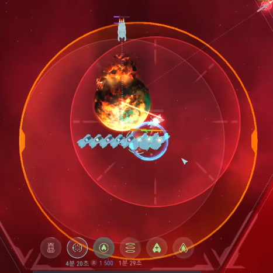

꿀광 캐는 김에 1행도 밀고 유물 캐오자... 로 시작된 비극...  
옆집 디스트로이어가 놀러왔고 3렙 블실은 수송선 5대에 전함 3대까지 감싸기엔 너무 얇았고...  
결국 수송선 5대가 터지는 비극으로 마무리...  
발송 모듈까지 달아 총 손해는 약 112,500 * 5대 = 562,500 클딧  
대략 0.7일의 수입을 손해보았다 ㅠ.ㅠ...  

[youtube video](https://www.youtube.com/watch?v=KfxtjN9HZPc)  

  
