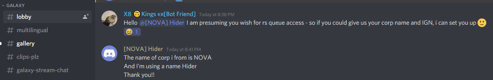
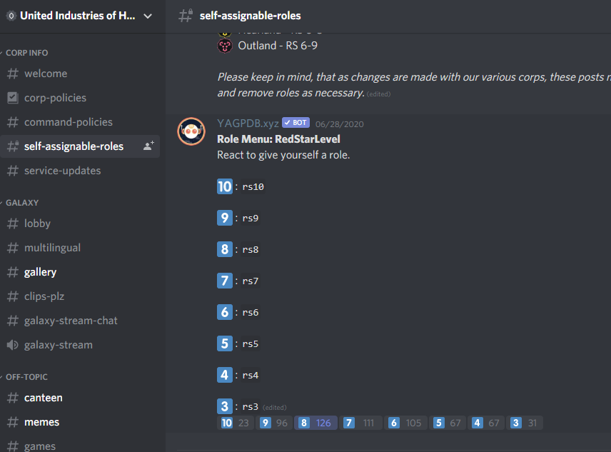
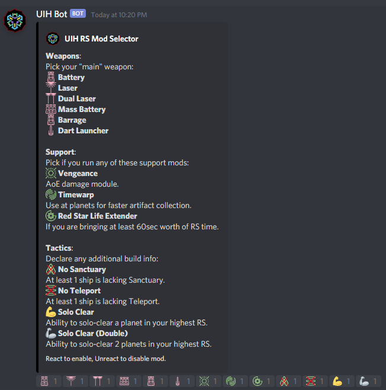
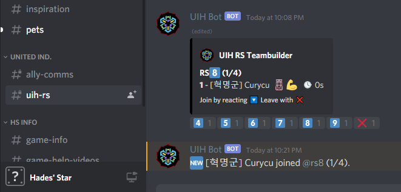
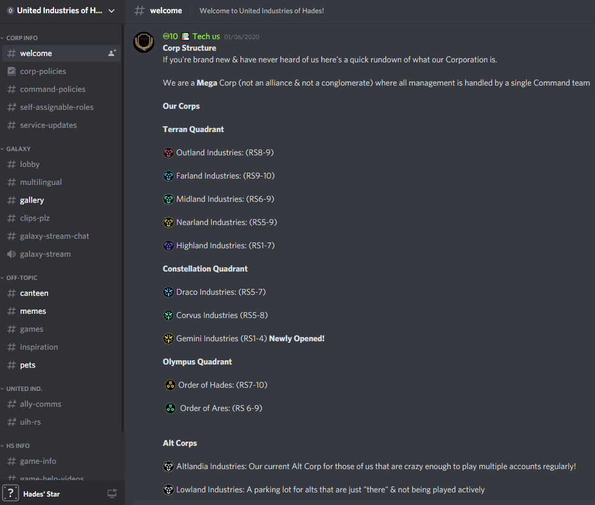

Mega Corp. 개념 및 소개  

Hades' Star 의 적색성단(이하 적성으로 축약표기) 매칭은 크게 2가지다  
  1. 전세계 유저 임의 매칭 (= 공개적성, 공적)  
  2. 코퍼레이션 내 비공개 매칭 (= 비공개적성, 비공)  

이때 1번의 문제는 수질(?) 이 너무 안좋다는 것이다  
매칭돼고 유물이 있는 행성을 클리어하기보단 크레딧을 주는 Croid 만 캐고있거나  
아예 전함은 워프를 시키지도 않는 날먹러가 있거나...  
심한 경우 인터셉터 및 디스트로이어를 이용한 트롤링까지 다양하다  

그래서 2번을 택하자니...   
내가 속해있는 코퍼레이션에 내가 도는 적성 레벨에 맞는 유저가 대기중인 경우가 적다는 단점이 있다  
이에 양쪽의 단점을 메꾸기 위해 생겨난 것이 콥들의 연합체인 "메가 코퍼레이션" (이하 메가콥으로 축약표기)이다  

메가콥을 만들기 위한 준비물은 다음과 같다  
  1. 디스코드 서버  
  2. 유저 매칭큐를 위한 봇 개발  
  3. 매칭된 유저들이 모여서 비공을 돌릴 코퍼레이션들 (자리가 부족할 경우를 대비해 여러개의 콥이 필요하다)  

현재 활발하게 돌고있는 메가콥으로는...  

[Black Star Order](https://discord.gg/8ZeEj63j) 
[United Industries of Hades ](https://discord.gg/t5nBWT8y) 등이 있다  

BSO 는 적성을 돌기위한 최소모듈렙 기준이 있으며 수소채굴 및 행성공략순서 등 룰이 타이트하다    
한편 UIH 의 경우 해당 최소조건이 없으며 전반적으로 자유로운 편이다  

플레이 자유도 : BSO < UIH < 공적  

필자는 UIH를 주로 돌기에 해당 메가콥 이용법에 대한 간단한 소개를 첨부한다  

1. 가입: 위 첨부한 discord url 을 통해 가입 후 #lobby 에서 관리자에게 게임 내 소속 콥 및 이름을 말하고 ally 권한을 받는다 (guest -> ally)  
  

2. self 권한주기 (적성 ping 요청): #self-assignable-roles 에서 ping (알림) 을 받길 원하는 적성 레벨 이모지를 클릭한다  
  

3. 자신의 전함 상태에 따른 정보 표시: #lobby 에서 !rsmod 라고 타이핑하면 DM(개인메세지) 으로 자신의 전함 상태를 표시할 수 있는 메뉴가 전달된다  
  

4. 적성 큐에 참여: #uih-rs 에서 참여하길 원하는 적성 레벨 이모지를 클릭한다  
  

5. 적절한 콥에 모여 비공 참여: 구성 자회사(?) 콥 명단은 #welcome 에 나와있으니 참고  
  
