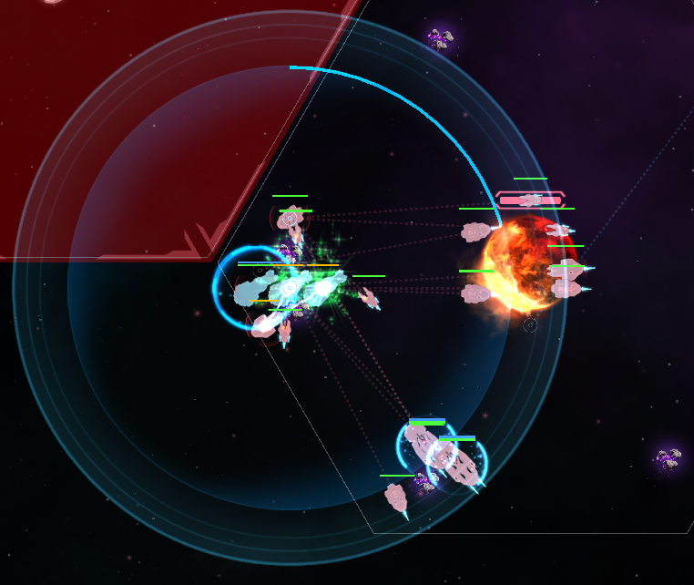

9적에서 광역실드 도입...  
처음엔 오메가실드 2대 빼고 광실 2대 넣었는데  
너무 종잇장이라... 선봉함은 오실로 교체했더니 편- 안.  

화력 딸려서 3포격 했더니  
피닉스 터지고 나오는 힐링포션(?) 인 센티넬들이  
독약으로 바뀌어서 엄청 따가웠는데 :skull_and_crossbones:   
이제 블실함 터질 걱정 안해도 되서 기쁘다 :laughing:  

  
