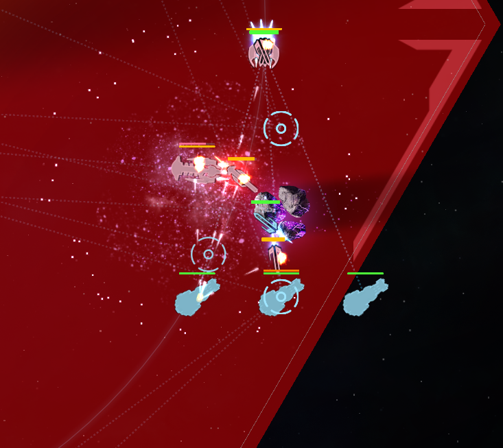

9적 다다대 조합으로 성공적 변경 :kissing_heart:  

처음에는 적응안돼서 1행 실패 3~5회 연속으로하다가...  
눈물을 흘리며 텔 모두 빼고 강화에 복수2개까지 껴서 1행 간신히 성공...  

이 렙 먹고 뚜벅이라니!!! :sob: 

하지만 좀 더 돌다보니 손(?)이 업그레이드 되어서 다시 강화랑 복수 하나 빼고 텔포 재설치 후 솔로 1행 성공!  
뚜벅이 탈출 성공 :innocent:  

현재 조합은  

8대형/4오실/8텔/7복수/3재활/1안식  
2다트/5블실/8텔/7장벽/3재활/1안식  
2다트/1광실/8텔/7장벽/3재활/1안식  

  
