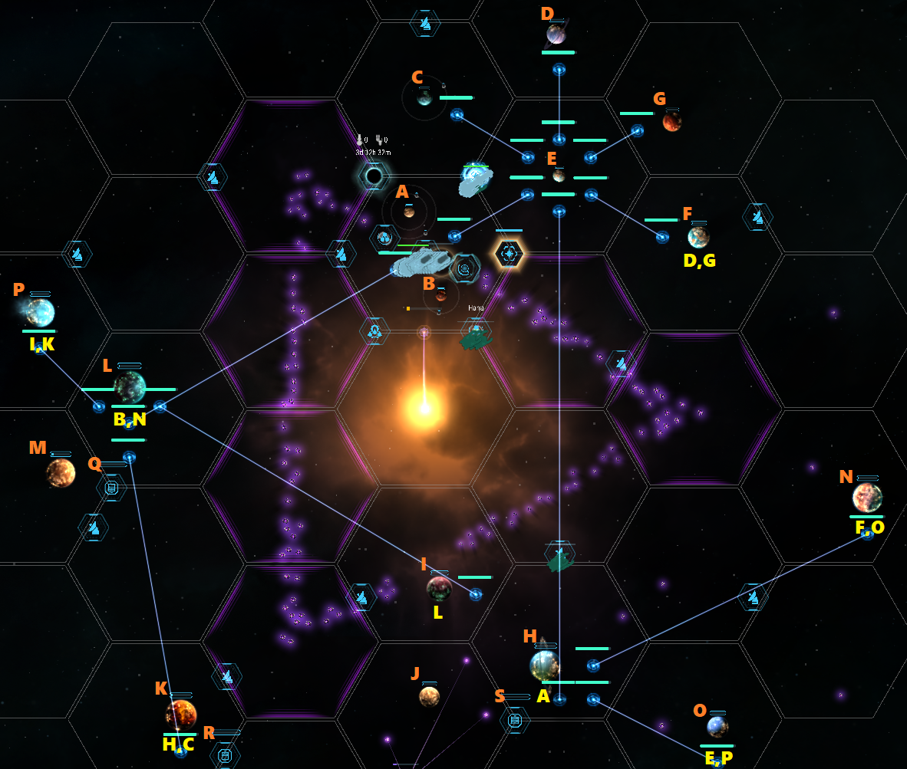

# 수송품 드론 이용한 수송 요약  

1. 수송품 목적지는 각 행성 & 위성 & 교역정거장 1/N 확률인듯 (체감)  
- 그렇다면 15렙 사막행성 (위성 2개) > 15렙 불행성 (위성 1개) = 15렙 바다행성 (위성 1개) > 나머지 행성 순으로 수송품 목적지가 많다  
- 수송품 목적지가 많을수록 워프레인 연결 우선순위가 높다  
  
2. 수송품 드론 보너스 %를 늘리려면 같은 목적지 수송품을 한 곳에 모아두는 것이 좋다  
- 50렙 행성들은 저장용량이 큰 편이라 수송품을 모아두는 역할에 딱이다  
- 50렙 행성들에 워프레인허브 연결된 목적지들을 분배한다  
- 참고로 행성의 수송품 최대 저장량은 수송품이 생산되는 최대량의 2배다 (50렙 가스행성은 40개 생산되므로 80개 저장가능)  
  
3. 워프레인허브 연결된 섹터가 아닌 곳으로 가는 수송품들은 몰아놓고 릴레이 혹은 직접 배달로 처리  
  
4. 교역정거장들은 행성에 최대한 가까이 붙여 수소를 절약할 것...!  
- 안타깝게도 행성 있는 섹터 안쪽에는 들어갈 수 없어 섹터 끝에 최대한 붙여놓는 게 한계다  
  
5. 주황색 : 목적지 ID, 노란색 : 모아놓는 장소  
  
  
 