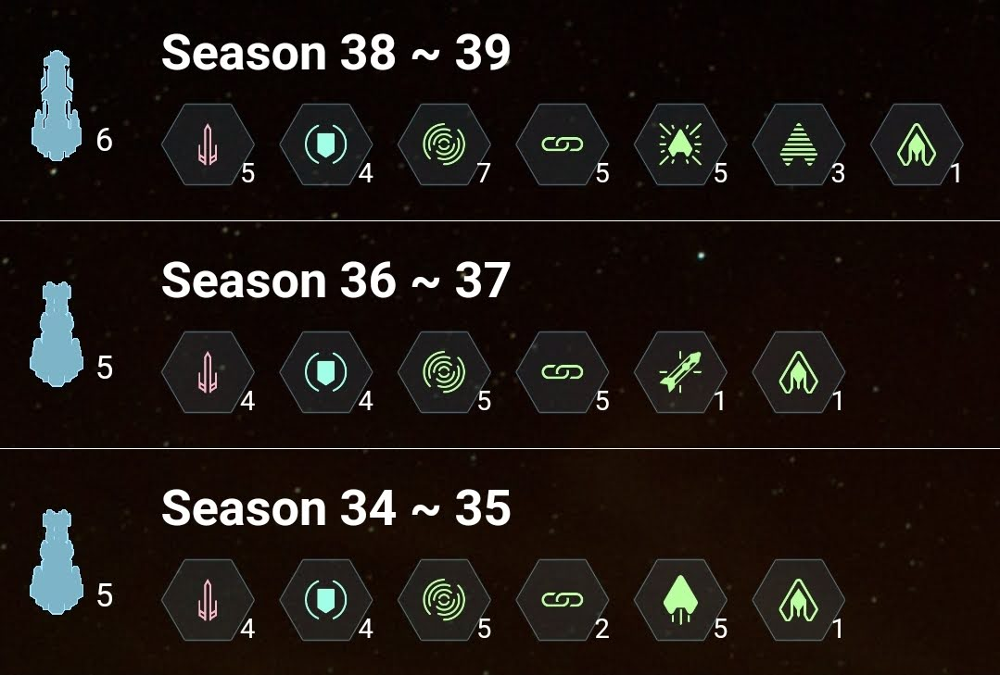

 

자그마치 청성 6개 시즌만에 마스터 왕관 획득 :sob: :crown:  
1,021점으로 마무리했고 내가 알기론 역대 청성 최대 점수다... 감동...  

 

시즌 38 ~ 39 에서 청성 매칭점수는 4,450점 이었고 시즌 36 ~ 37 때 셋팅보다 좀 더 방어에 신경 썼더니 결과가 훨씬 좋았다  
오메가로켓이 시원시원한 맛은 있는데 상대 끈텔 대응을 고려해보면 아무래도 운명이 훨 낫고,  
 
무엇보다 마지막 중앙셀에서 전함들 내쪽으로 동시에 몰려와서 샌드위치될 때에 스텔스로 타겟팅 피한 뒤 한놈씩 조지는게(?) 탁월했다..  
그리고 다트들면 피할 수 없는 인셉 대응도 스텔스가 매우매우 유용해서 한 5 ~ 6판 정도는 이놈덕에 망할판 1등한듯..  

시즌 34 ~35 때는... 매칭점수 3,650점으로 준수한 편이었는데,  
아무래도 탈출기가 없고 끈이 2레벨이다 보니 5렙 끈에 너무 무력했다는 점이 아쉬운 셋팅으로 기억이 남는다  
하지만 손맛은 끈펄스를 따라올 콤보가 과연 있을까...? :star_struck:   

  
